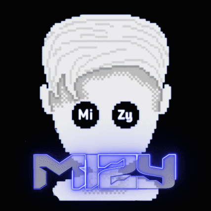

<h1 align="center">
    <a href="#"></a>
    <br>MiZy Discord Bot
</h1>

<p align="center">
    MiZy Discord Bot is a multipurpose Discord bot with over 50+ commands ready to elevate your Discord server!
    <br>
    MiZy is designed with Moderation, Giveaways, Music, Fun & so much more!
</p>

<p align="center">
    <a href="https://github.com/discordjs/discord.js/">
        
    </a>
    <a href="https://github.com/MustafaYamout/MiZy-Discord-Bot/stargazers">
        
    </a>
    <a href="https://github.com/MustafaYamout/MiZy-Discord-Bot/network/members">
        
    </a>
    <a href="https://github.com/MustafaYamout/MiZy-Discord-Bot/graphs/contributors">
        
    </a>
    <a href="https://github.com/MustafaYamout/MiZy-Discord-Bot/issues">
        
    </a>
    <a href="https://github.com/MustafaYamout/MiZy-Discord-Bot/blob/main/LICENSE">
        
    </a>
</p>

## Table of Content
* [Features](#features)
* [Requirements](#requirements)
* [Installation Guide](#installation-guide)
* [Author](#author)
* [Contributing](#contributing)
* [Project Activity](#project-activity)
* [License](#license)


## Features
- [x] Discord.js v14.27
- [x] Slash Commands
- [x] Moderation
- [x] Giveaways
- [x] Music
- [ ] Auto-Moderation
- [ ] Ticket System
- [ ] Economy
- [ ] Welcome & Leave Messages

## Requirements
- Node.js **v22.12.0 or newer**
- Discord Token from the [Discord Developer Portal][discord-portal]
- MongoDB URL from [MongoDB](mongodb)
- Client ID
- Owner ID (Your Discord ID)
- **FFmpeg on your PATH** — the music system requires it, and DisTube v5 explicitly does *not*
  work with the `ffmpeg-static` package. On Windows: `winget install Gyan.FFmpeg`, then restart
  your terminal and confirm with `ffmpeg -version`.
- **Network access on first boot** — `@distube/yt-dlp` downloads a fresh `yt-dlp` binary
  the first time the bot starts, and on every boot after. This is deliberate: a pinned
  `yt-dlp` goes stale and starts returning stream URLs that no longer work. The first
  start after `npm install` takes a few seconds longer than usual.

### Privileged Intents

Enable both of these in the Discord Developer Portal under **Bot → Privileged Gateway Intents**,
or the corresponding features will not work:

- **Server Members Intent** — required by `/serverinfo` and by the giveaway manager
- **Presence Intent** — not currently required

## Installation Guide

1. Clone the repository
```bash
git clone https://github.com/MustafaYamout/MiZy-Discord-Bot.git
cd MiZy-Discord-Bot
```
2. Rename `.env.example` to `.env` and fill in the required information:
```bash
cp .env.example .env
```
   The variables are:
   - `token` — your bot token
   - `clientid` — your application (client) ID
   - `ownerid` — your Discord user ID; gates `/eval` and `/addbalance`
   - `mongotoken` — your MongoDB connection string
3. Install the packages
```bash
npm install
```
4. Start the bot
```bash
npm start
```

Slash commands are registered globally on every boot, so any change to a `SlashCommandBuilder` in
`commands/` takes effect after a restart. Note that this **overwrites all global application
commands** for the bot.

Don't want to self-host the bot? Add the [MiZy Bot!](https://discord.com/oauth2/authorize?client_id=752384586398302279&permissions=1007021182&scope=bot%20applications.commands) into your server (BOT STILL IN DEVELOPMENT)

## Contributing
1. [Fork this repository](fork)
2. Clone your fork:
```bash
git clone https://github.com/your-username/MiZy-Discord-Bot.git
```
3. Create your feature branch: 
```bash
git checkout -b <branch-name>
```
4. Commit your changes:
```bash
git commit -m <commit message>
```
5. Push to the branch:
```bash
git push -u origin <branch-name>
```
6. Submit a pull request

## Project Activity


## License
This project is licensed under the [GNU GPL-3.0](https://choosealicense.com/licenses/gpl-3.0/) License - see the [LICENSE](LICENSE) file for details.

#### Actual GitHub Repository date: July 27, 2023.

[fork]: https://github.com/MustafaYamout/MiZy-Discord-Bot/fork
[discord-portal]: https://discord.com/developers/applications
[mongodb]: https://www.mongodb.com/
